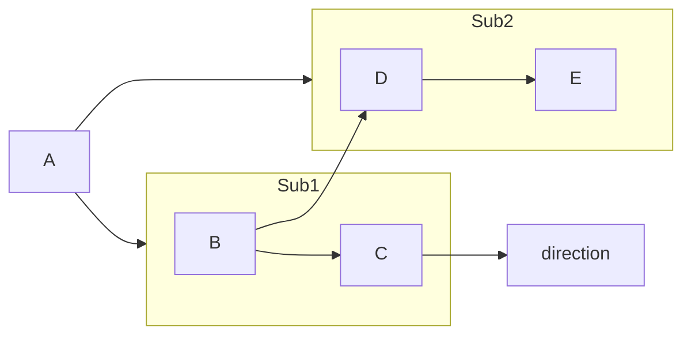
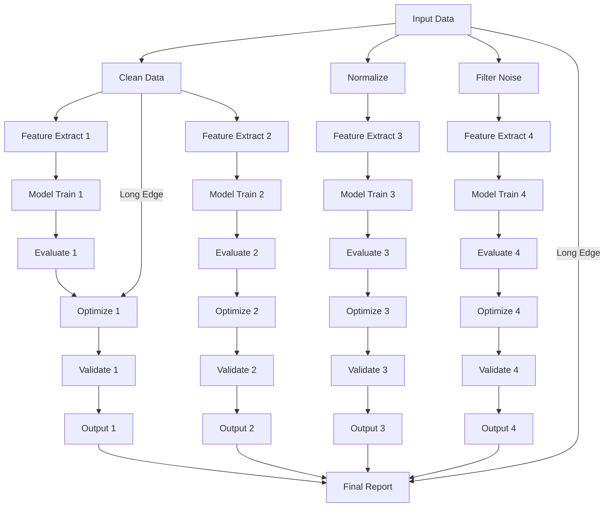
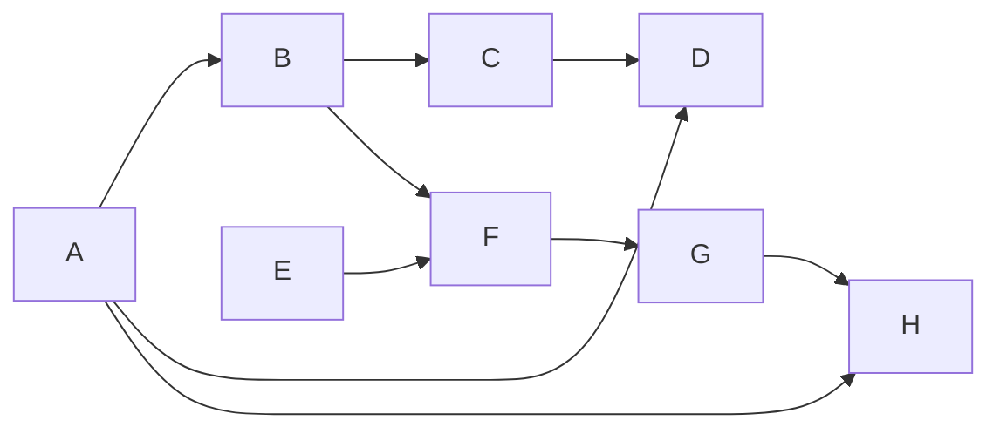

### 测试用例


说明：

主图：水平布局（graph LR），A 连接到 Sub1 和 Sub2。
Sub1：垂直布局（direction TB），B 在上，C 在下。
Sub2：水平布局（direction LR），D 在左，E 在右。
跨子图边：B --> D, C --> D，表示 Sub1 的节点连接到 Sub2 的 D，由主图管理。
层级预期：
主图：两层（[A], [Sub1, Sub2]）。
Sub1：两层（[B], [C]）。
Sub2：两层（[D], [E]）。
跨子图边不影响层分配，但影响连线绘制（推迟讨论）。


### 测试用例2


```c++
// 添加节点
    Q_ASSERT(model->addNode(nullptr, NodeId("A"), NodeType::REGULAR)); // 层 1: Input Data
    Q_ASSERT(model->addNode(nullptr, NodeId("B1"), NodeType::REGULAR)); // 层 2: Clean Data
    Q_ASSERT(model->addNode(nullptr, NodeId("B2"), NodeType::REGULAR)); // Normalize
    Q_ASSERT(model->addNode(nullptr, NodeId("B3"), NodeType::REGULAR)); // Filter Noise
    Q_ASSERT(model->addNode(nullptr, NodeId("C1"), NodeType::REGULAR)); // 层 3: Feature Extract 1
    Q_ASSERT(model->addNode(nullptr, NodeId("C2"), NodeType::REGULAR)); // Feature Extract 2
    Q_ASSERT(model->addNode(nullptr, NodeId("C3"), NodeType::REGULAR)); // Feature Extract 3
    Q_ASSERT(model->addNode(nullptr, NodeId("C4"), NodeType::REGULAR)); // Feature Extract 4
    Q_ASSERT(model->addNode(nullptr, NodeId("D1"), NodeType::REGULAR)); // 层 4: Model Train 1
    Q_ASSERT(model->addNode(nullptr, NodeId("D2"), NodeType::REGULAR)); // Model Train 2
    Q_ASSERT(model->addNode(nullptr, NodeId("D3"), NodeType::REGULAR)); // Model Train 3
    Q_ASSERT(model->addNode(nullptr, NodeId("D4"), NodeType::REGULAR)); // Model Train 4
    Q_ASSERT(model->addNode(nullptr, NodeId("E1"), NodeType::REGULAR)); // 层 5: Evaluate 1
    Q_ASSERT(model->addNode(nullptr, NodeId("E2"), NodeType::REGULAR)); // Evaluate 2
    Q_ASSERT(model->addNode(nullptr, NodeId("E3"), NodeType::REGULAR)); // Evaluate 3
    Q_ASSERT(model->addNode(nullptr, NodeId("E4"), NodeType::REGULAR)); // Evaluate 4
    Q_ASSERT(model->addNode(nullptr, NodeId("F1"), NodeType::REGULAR)); // 层 6: Optimize 1
    Q_ASSERT(model->addNode(nullptr, NodeId("F2"), NodeType::REGULAR)); // Optimize 2
    Q_ASSERT(model->addNode(nullptr, NodeId("F3"), NodeType::REGULAR)); // Optimize 3
    Q_ASSERT(model->addNode(nullptr, NodeId("F4"), NodeType::REGULAR)); // Optimize 4
    Q_ASSERT(model->addNode(nullptr, NodeId("G1"), NodeType::REGULAR)); // 层 7: Validate 1
    Q_ASSERT(model->addNode(nullptr, NodeId("G2"), NodeType::REGULAR)); // Validate 2
    Q_ASSERT(model->addNode(nullptr, NodeId("G3"), NodeType::REGULAR)); // Validate 3
    Q_ASSERT(model->addNode(nullptr, NodeId("G4"), NodeType::REGULAR)); // Validate 4
    Q_ASSERT(model->addNode(nullptr, NodeId("H1"), NodeType::REGULAR)); // 层 8: Output 1
    Q_ASSERT(model->addNode(nullptr, NodeId("H2"), NodeType::REGULAR)); // Output 2
    Q_ASSERT(model->addNode(nullptr, NodeId("H3"), NodeType::REGULAR)); // Output 3
    Q_ASSERT(model->addNode(nullptr, NodeId("H4"), NodeType::REGULAR)); // Output 4
    Q_ASSERT(model->addNode(nullptr, NodeId("I"), NodeType::REGULAR)); // 层 9: Final Report

    // 添加边
    Q_ASSERT(model->addEdge(nullptr, SourceId("A"), nullptr, TargetId("B1")));
    Q_ASSERT(model->addEdge(nullptr, SourceId("A"), nullptr, TargetId("B2")));
    Q_ASSERT(model->addEdge(nullptr, SourceId("A"), nullptr, TargetId("B3")));
    Q_ASSERT(model->addEdge(nullptr, SourceId("B1"), nullptr, TargetId("C1")));
    Q_ASSERT(model->addEdge(nullptr, SourceId("B1"), nullptr, TargetId("C2")));
    Q_ASSERT(model->addEdge(nullptr, SourceId("B2"), nullptr, TargetId("C3")));
    Q_ASSERT(model->addEdge(nullptr, SourceId("B3"), nullptr, TargetId("C4")));
    Q_ASSERT(model->addEdge(nullptr, SourceId("C1"), nullptr, TargetId("D1")));
    Q_ASSERT(model->addEdge(nullptr, SourceId("C2"), nullptr, TargetId("D2")));
    Q_ASSERT(model->addEdge(nullptr, SourceId("C3"), nullptr, TargetId("D3")));
    Q_ASSERT(model->addEdge(nullptr, SourceId("C4"), nullptr, TargetId("D4")));
    Q_ASSERT(model->addEdge(nullptr, SourceId("D1"), nullptr, TargetId("E1")));
    Q_ASSERT(model->addEdge(nullptr, SourceId("D2"), nullptr, TargetId("E2")));
    Q_ASSERT(model->addEdge(nullptr, SourceId("D3"), nullptr, TargetId("E3")));
    Q_ASSERT(model->addEdge(nullptr, SourceId("D4"), nullptr, TargetId("E4")));
    Q_ASSERT(model->addEdge(nullptr, SourceId("E1"), nullptr, TargetId("F1")));
    Q_ASSERT(model->addEdge(nullptr, SourceId("E2"), nullptr, TargetId("F2")));
    Q_ASSERT(model->addEdge(nullptr, SourceId("E3"), nullptr, TargetId("F3")));
    Q_ASSERT(model->addEdge(nullptr, SourceId("E4"), nullptr, TargetId("F4")));
    Q_ASSERT(model->addEdge(nullptr, SourceId("F1"), nullptr, TargetId("G1")));
    Q_ASSERT(model->addEdge(nullptr, SourceId("F2"), nullptr, TargetId("G2")));
    Q_ASSERT(model->addEdge(nullptr, SourceId("F3"), nullptr, TargetId("G3")));
    Q_ASSERT(model->addEdge(nullptr, SourceId("F4"), nullptr, TargetId("G4")));
    Q_ASSERT(model->addEdge(nullptr, SourceId("G1"), nullptr, TargetId("H1")));
    Q_ASSERT(model->addEdge(nullptr, SourceId("G2"), nullptr, TargetId("H2")));
    Q_ASSERT(model->addEdge(nullptr, SourceId("G3"), nullptr, TargetId("H3")));
    Q_ASSERT(model->addEdge(nullptr, SourceId("G4"), nullptr, TargetId("H4")));
    Q_ASSERT(model->addEdge(nullptr, SourceId("H1"), nullptr, TargetId("I")));
    Q_ASSERT(model->addEdge(nullptr, SourceId("H2"), nullptr, TargetId("I")));
    Q_ASSERT(model->addEdge(nullptr, SourceId("H3"), nullptr, TargetId("I")));
    Q_ASSERT(model->addEdge(nullptr, SourceId("H4"), nullptr, TargetId("I")));
    // 长边
    Q_ASSERT(model->addEdge(nullptr, SourceId("A"), nullptr, TargetId("I"))); // A -> I
    Q_ASSERT(model->addEdge(nullptr, SourceId("B1"), nullptr, TargetId("F1"))); // B1 -> F1
```

说明：
流程图说明：

层级（10 层）：
层 1：[A]（输入）。
层 2：[B1, B2, B3]（预处理）。
层 3：[C1, C2, C3, C4]（特征提取）。
层 4：[D1, D2, D3, D4]（模型训练）。
层 5：[E1, E2, E3, E4]（评估）。
层 6：[F1, F2, F3, F4]（优化）。
层 7：[G1, G2, G3, G4]（验证）。
层 8：[H1, H2, H3, H4]（输出）。
层 9：[I]（最终报告）。
层 10：虚拟节点（为长边 A -> I, B1 -> F1）。
节点数：
每层 1-8 个节点（层 3-8 最多 8 个）。
长边：
A -> I：从第 1 层到第 9 层，跨越 8 层。
B1 -> F1：从第 2 层到第 6 层，跨越 4 层。
并行分支：
预处理（B1-B3）、特征提取（C1-C4）等阶段有多个并行节点。

### 测试用例3


```c++
// 添加节点
    Q_ASSERT(model->addNode(nullptr, NodeId("A"), NodeType::REGULAR));
    Q_ASSERT(model->addNode(nullptr, NodeId("B"), NodeType::REGULAR));
    Q_ASSERT(model->addNode(nullptr, NodeId("C"), NodeType::REGULAR));
    Q_ASSERT(model->addNode(nullptr, NodeId("D"), NodeType::REGULAR));
    Q_ASSERT(model->addNode(nullptr, NodeId("E"), NodeType::REGULAR));
    Q_ASSERT(model->addNode(nullptr, NodeId("F"), NodeType::REGULAR));
    Q_ASSERT(model->addNode(nullptr, NodeId("G"), NodeType::REGULAR));
    Q_ASSERT(model->addNode(nullptr, NodeId("H"), NodeType::REGULAR));

    // 添加边
    Q_ASSERT(model->addEdge(nullptr, SourceId("A"), nullptr, TargetId("B")));
    Q_ASSERT(model->addEdge(nullptr, SourceId("B"), nullptr, TargetId("C")));
    Q_ASSERT(model->addEdge(nullptr, SourceId("C"), nullptr, TargetId("D")));
    Q_ASSERT(model->addEdge(nullptr, SourceId("E"), nullptr, TargetId("F")));
    Q_ASSERT(model->addEdge(nullptr, SourceId("F"), nullptr, TargetId("G")));
    Q_ASSERT(model->addEdge(nullptr, SourceId("G"), nullptr, TargetId("H")));
    Q_ASSERT(model->addEdge(nullptr, SourceId("B"), nullptr, TargetId("F"))); // 
    Q_ASSERT(model->addEdge(nullptr, SourceId("A"), nullptr, TargetId("D"))); // Cross 2 levels
    Q_ASSERT(model->addEdge(nullptr, SourceId("A"), nullptr, TargetId("H"))); // 跨
```